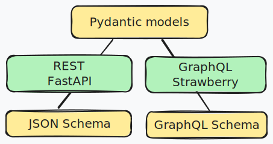
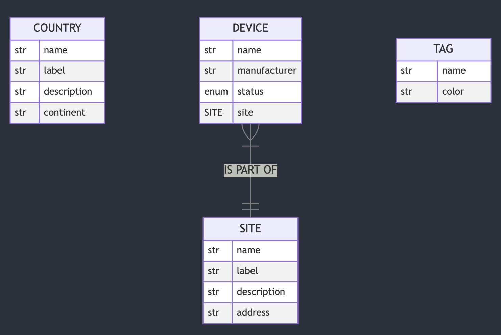

## Explore Pydantic, JSON Schema and GraphQL

The goal of this lab is to get more familiar with 3 schemas languages that we covered during the presentation:
- Pydantic
- JSON Schema
- GraphQL

## Sample application

To save some time and focus on the most important part of the lab, a sample application providing exporing the same data in all 3 formats is available.

The internal model of the application is defined using Pydantic
- On one side, the data is available using a REST api provided by Pydantic
- On the other side, the data is available via GraphQL interface

To get started, 4 objects are provided as part of the model with a One to Many relationship between Device and Site.

