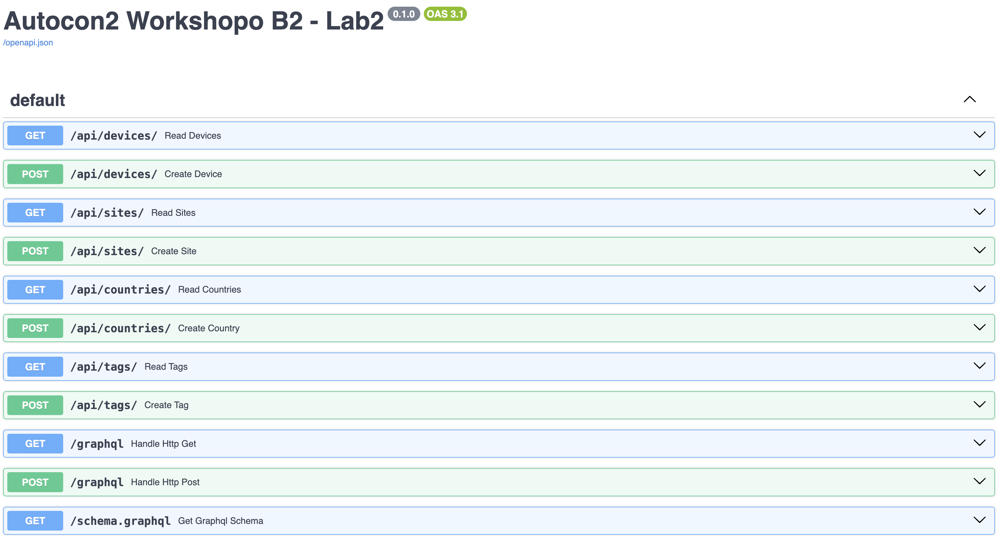
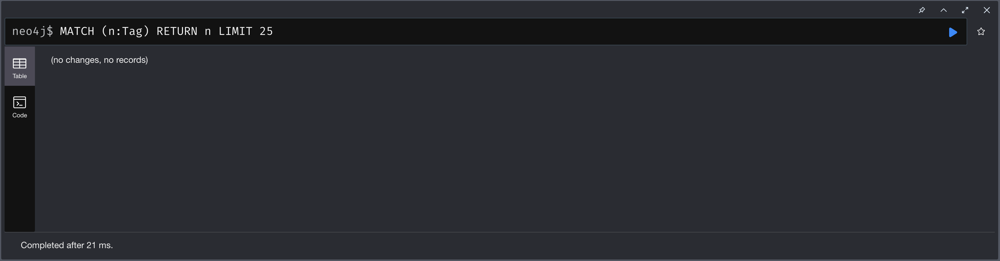
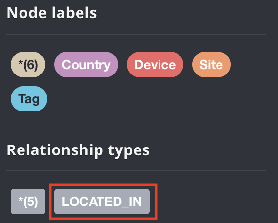
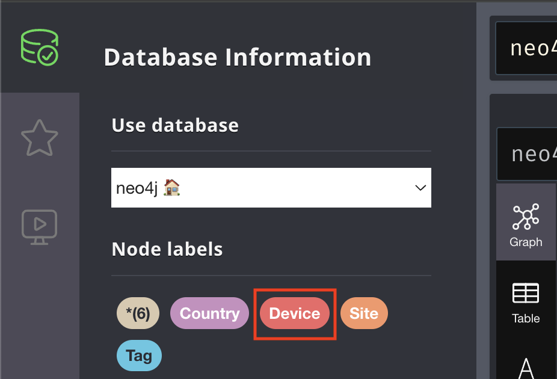
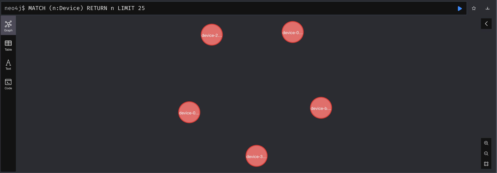
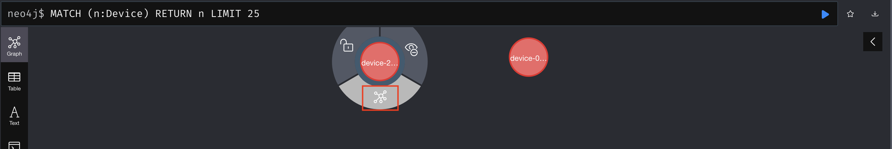
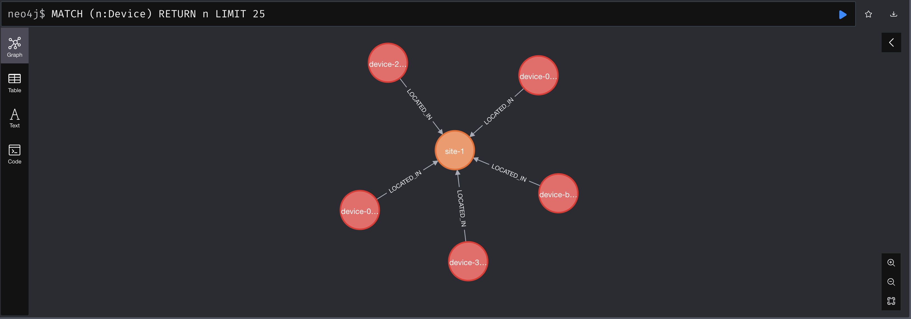
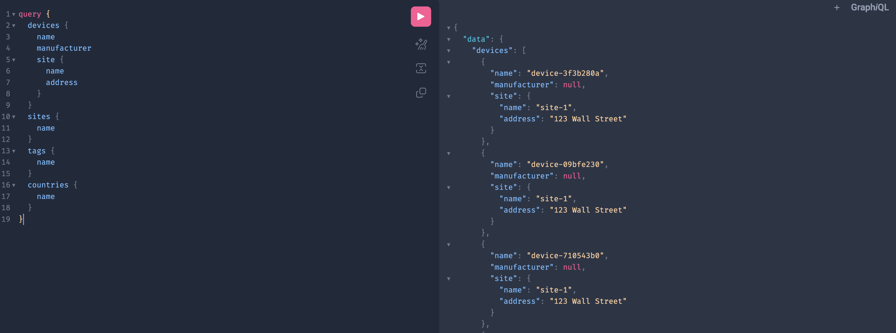

## 1. Starting and exploring the API

The first step is to start the API using Invoke.

```shell
invoke lab2-start
```
```shell
 Network ac2-workshop-data-modeling_default  Creating
 Network ac2-workshop-data-modeling_default  Created
 Volume "ac2-workshop-data-modeling_database_logs"  Creating
 Volume "ac2-workshop-data-modeling_database_logs"  Created
 Volume "ac2-workshop-data-modeling_database_data"  Creating
 Volume "ac2-workshop-data-modeling_database_data"  Created
 Container ac2-workshop-data-modeling-database-1  Creating
 Container ac2-workshop-data-modeling-database-1  Created
 Container ac2-workshop-data-modeling-database-1  Starting
 Container ac2-workshop-data-modeling-database-1  Started
INFO     Using path workshop_b2/lab2/main.py                                    
INFO     Resolved absolute path                                                 
         /Users/Mikhail/cloned/ac2-workshop-data-modeling/workshop_b2/lab2/main.
         py                                                                     
INFO     Searching for package file structure from directories with __init__.py 
         files                                                                  
INFO     Importing from /Users/Mikhail/cloned/ac2-workshop-data-modeling        
                                                                                
 ╭─ Python package file structure ─╮                                            
 │                                 │                                            
 │  📁 workshop_b2                 │                                            
 │  ├── 🐍 __init__.py             │                                            
 │  └── 📁 lab2                    │                                            
 │      ├── 🐍 __init__.py         │                                            
 │      └── 🐍 main.py             │                                            
 │                                 │                                            
 ╰─────────────────────────────────╯                                            
                                                                                
INFO     Importing module workshop_b2.lab2.main                                 
INFO     Found importable FastAPI app                                           
                                                                                
 ╭──────── Importable FastAPI app ─────────╮                                    
 │                                         │                                    
 │  from workshop_b2.lab2.main import app  │                                    
 │                                         │                                    
 ╰─────────────────────────────────────────╯                                    
                                                                                
INFO     Using import string workshop_b2.lab2.main:app                          
                                                                                
 ╭─────────── FastAPI CLI - Production mode ───────────╮                        
 │                                                     │                        
 │  Serving at: http://0.0.0.0:8001                    │                        
 │                                                     │                        
 │  API docs: http://0.0.0.0:8001/docs                 │                        
 │                                                     │                        
 │  Running in production mode, for development use:   │                        
 │                                                     │                        
 │  fastapi dev                                        │                        
 │                                                     │                        
 ╰─────────────────────────────────────────────────────╯                        
                                                                                
INFO:     Will watch for changes in these directories: ['/Users/Mikhail/cloned/ac2-workshop-data-modeling']
INFO:     Uvicorn running on http://0.0.0.0:8001 (Press CTRL+C to quit)
INFO:     Started reloader process [63280] using WatchFiles
INFO:     Started server process [63284]
INFO:     Waiting for application startup.
Unable to retrieve routing information
INFO:     Application startup complete.
```

Navigate to the [API](http://localhost:8001/docs) once you see **Application startup complete**.

:::info
The API is available on port 8001
:::

There are multiple endpoints to manage creating and reading **devices**, **sites**, **countries**, and **tags**.



It is possible to see a graphical representation of the Neo4j database. Navigate to the local [Neo4j UI](http://localhost:7474).

Click on the **database** icon in the top left.


There are node labels that correlate to each API endpoint.


Click on any of the labels that match the API endpoints and the search should return no records at this time.



## 2. Loading data

Open a new terminal window and load in dummy data.

:::warning
This step is important as the API must remain running and will be in the foreground of the previous terminal.
:::


```shell
invoke lab2-load
```
```shell
Creating device: {'name': 'device-9b9ba14a', 'manufacturer': None, 'status': <DeviceStatus.ACTIVE: 'active'>, 'site': {'name': 'site-1', 'label': 'site-1', 'description': None, 'address': '123 Wall Street'}}
Creating device: {'name': 'device-0dc44bef', 'manufacturer': None, 'status': <DeviceStatus.ACTIVE: 'active'>, 'site': {'name': 'site-1', 'label': 'site-1', 'description': None, 'address': '123 Wall Street'}}
Creating device: {'name': 'device-eb98ce97', 'manufacturer': None, 'status': <DeviceStatus.ACTIVE: 'active'>, 'site': {'name': 'site-1', 'label': 'site-1', 'description': None, 'address': '123 Wall Street'}}
Creating device: {'name': 'device-20262e7d', 'manufacturer': None, 'status': <DeviceStatus.ACTIVE: 'active'>, 'site': {'name': 'site-1', 'label': 'site-1', 'description': None, 'address': '123 Wall Street'}}
Creating device: {'name': 'device-e1f047aa', 'manufacturer': None, 'status': <DeviceStatus.ACTIVE: 'active'>, 'site': {'name': 'site-1', 'label': 'site-1', 'description': None, 'address': '123 Wall Street'}}
```

The page should auto refresh and now there will be a new relationship called **LOCATED_IN**.



Click on the **Device** Node Label.



There should be 5 device nodes displayed.



Click on any of the nodes and then click on the relationship icon.



All current nodes have a **LOCATED_IN** relationship to **site-1**. This relationship mimics a [Foreign Key](https://www.reddit.com/r/SQL/comments/qras0z/please_explain_foreign_keys_to_me_like_i_am_six/) relationship.



Navigate to the [GraphQL UI](http://localhost:8001/graphql). Copy in the following query and then execute it.

```graphql
query {
  devices {
    name
    manufacturer
    site {
      name
      address
    }
  }
  sites {
    name
  }
  tags {
    name
  }
  countries {
    name
  }
}
```

The query provides the devices and site information for each device.



Scroll down to see the data fetched for **sites**, **tags**, and **countries**.


:::warning
TODO: We can load in another site and show two sites and their relationship to devices, but will omit for now.
``invoke lab2-load --site-name site-2``
:::

Currently, tags are a standalone model and do not have relationships with any other models. It may prove useful to allow multiple tags to be added to multiple devices.

The next steps will implement a [Many-to-Many](https://en.wikipedia.org/wiki/Many-to-many_(data_model)) relationship between tags and devices within a graph database.

:::success
Time to get our hands on some code!
:::
