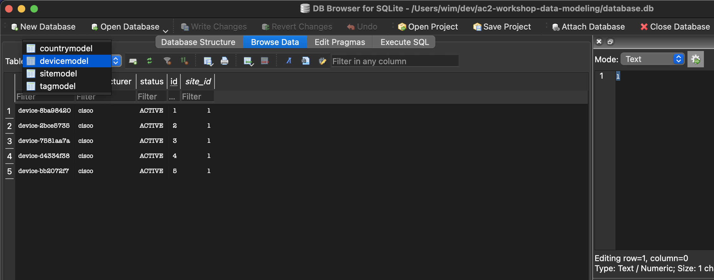
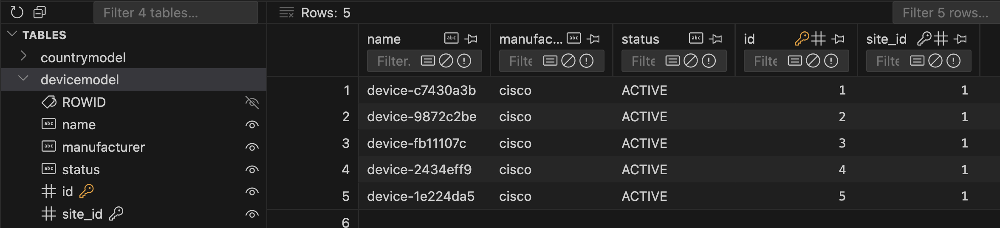
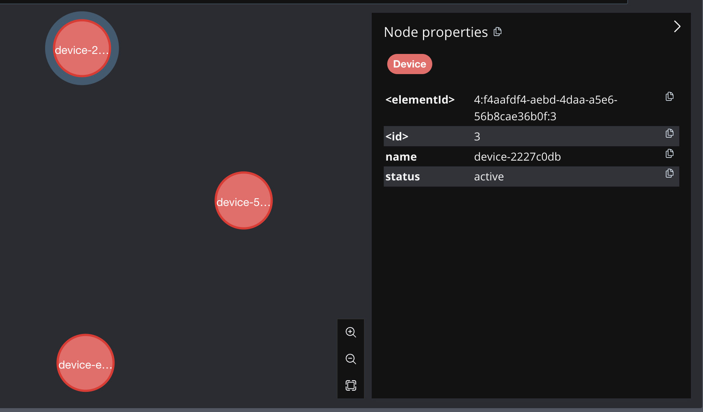

import Tabs from '@theme/Tabs';
import TabItem from '@theme/TabItem';
import ReferenceLink from "../../src/components/Card";

## Exploring the data in SQLite

Open the database in either [DB Browser for SQLite](https://sqlitebrowser.org/dl/) or [SQLite viewer plugin for Visual Studio Code](https://marketplace.visualstudio.com/items?itemName=qwtel.sqlite-viewer&ssr=false#overview)

<Tabs>
<TabItem value="DBBrowser for SQLite" default>

Launch **DB Browser for SQLite**

Open the **database.db** file in the project directory.

Click on the **Browse Data** tab and select the **devicemodel** table.

</TabItem>
<TabItem value="VSCode - SQLite Browser">

Double click the **database.db** file within VSCode.

Expand the **devicemodel** to view the data.

</TabItem>
</Tabs>

Each device is represented as a row in the **devicemodel** table.

The **site_id** column of each row references the ID of a row in the **sitemodel** table. This models a one to many relationship otherwise known as a **ForeignKey** relationship.

## Exploring the data in the graph database (Neo4j)

Navigate to the [Neo4j Browser](http://localhost:7474). 

Click on the **database** icon in the top left.

Click on the **Device** Node Label.

There should be 5 device nodes displayed.

Click one of the device nodes to see the properties of the node.

We can see that attributes of an instance of a **devicemodel** are stored as the properties of the node.

Click on the device node again and select the **relationships** icon.

The node has a relationship to **site-1** with a label of **LOCATED_IN** that represents the type of the relationship. This relationship mimics a [Foreign Key](https://www.reddit.com/r/SQL/comments/qras0z/please_explain_foreign_keys_to_me_like_i_am_six/) relationship.

Currently, tags are a standalone model and do not have relationships with any other models. It may prove useful to allow multiple tags to be added to multiple devices.

The next steps will implement a [Many-to-Many](https://en.wikipedia.org/wiki/Many-to-many_(data_model)) relationship between tags and devices within both types of databases.

:::success
Time to get our hands on some code!
:::
