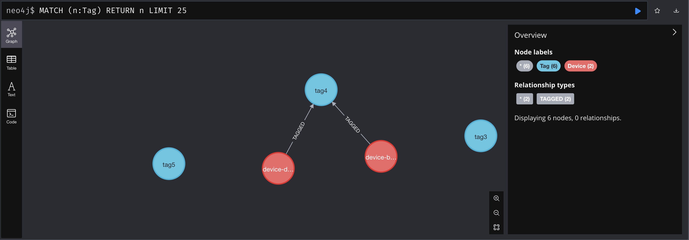
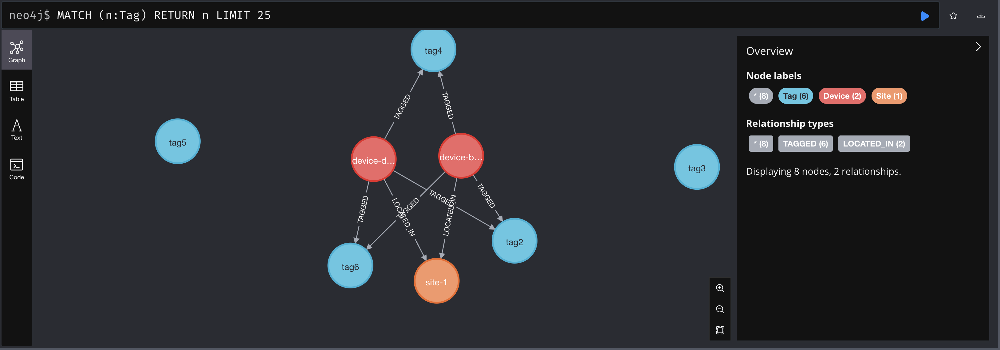

import Tabs from '@theme/Tabs';
import TabItem from '@theme/TabItem';
import ReferenceLink from "../../src/components/Card";

## Exploring Many-to-Many Relationships in SQLite

Open **workshop_b2/lab1/database/models.py** and uncomment any of the commented out lines in this file and save your changes.

:::info
The application will automatically restart.
:::

## Exploring Many-to-Many Relationships in Neo4j

The first step will be to add a ``TagsMixin`` into **workshop_b2/lab2/database/models.py**.

At the top of the there is a ``def _build_filter_query`` method, add the following code below that function.

```python
class TagMixin:
    tags: list[Tag] = Field(default_factory=list)

    def add_tags(self, db: Driver, tags: list[Tag]):
        """Add tags to a node.

        Args:
            db (Driver): Neo4j driver instance.
            tags (list[Tag]): List of tags to add.
        """
        node_label = self.__class__.__name__.replace("Model", "").title()
        node_short = node_label[0]
        for tag in tags:
            query = (
                f"MATCH ({node_short}:{node_label}" + " {name: $name})"
                "OPTIONAL MATCH (t:Tag {name: " + f'"{tag.name}"' + "})"
                f"MERGE ({node_short})-[:TAGGED]->(t)"
            )
            db.execute_query(
                query, {"name": self.name, "tags": [t.model_dump() for t in tags]}
            )

```

Add the ``TagsMixin`` class to the ``DeviceModel``.

```python
class DeviceModel(Device, TagMixin):
```

Next, update the ``create`` method on the ``DeviceModel`` to add the tags if they exist.

```python
if self.tags:
    self.add_tags(db, self.tags)

# shown for placement purposes
return self.get(db)
```

Now navigate to **workshop_b2/models.py** and add the following line to the **Device** class.

```python
class Device(BaseModel):
    name: str
    manufacturer: str | None = None
    status: DeviceStatus = DeviceStatus.ACTIVE
    tags: list[Tag] = Field(default_factory=list)
```

Run the load command with the ``--tags`` option.

```shell
invoke lab2-load --tags
```

Navigate back to the local [Neo4j UI](http://localhost:7474).

Click on any of the tags and then click on the **relationship** icon.



Click on the **relationship** icon for one of the devices tied to the selected tag.



Now we can see that devices can have multiple tags and tags can have multiple devices.