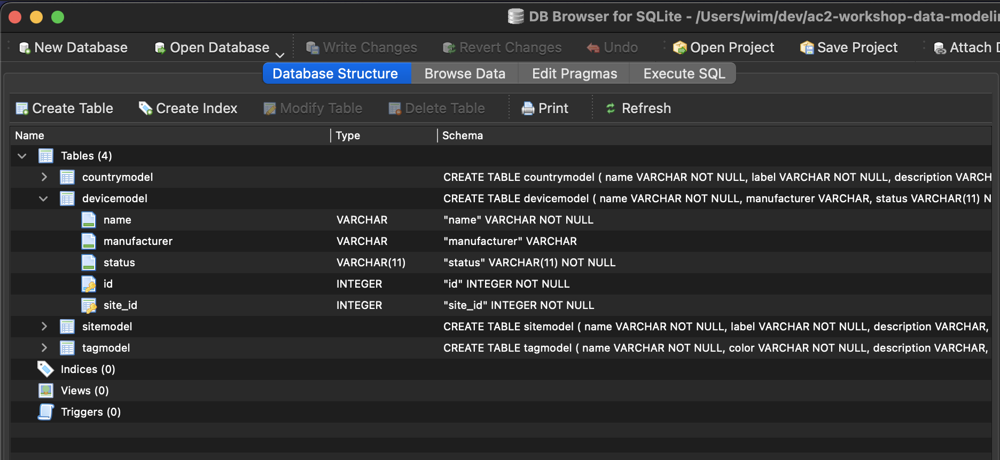
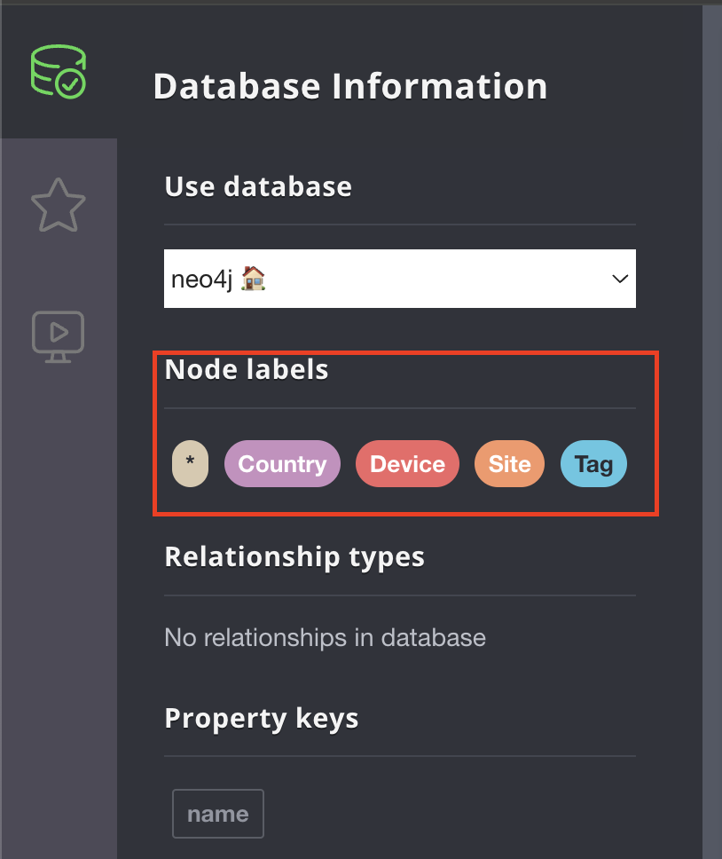

import Tabs from '@theme/Tabs';
import TabItem from '@theme/TabItem';
import ReferenceLink from "../../src/components/Card";

## Exploring the schema in SQLite

Open the database in either [DB Browser for SQLite](https://sqlitebrowser.org/dl/) or [SQLite viewer plugin for Visual Studio Code](https://marketplace.visualstudio.com/items?itemName=qwtel.sqlite-viewer&ssr=false#overview)

<Tabs>
<TabItem value="DBBrowser for SQLite" default>

Launch **DB Browser for SQLite**

Open the **database.db** file in the project directory.

</TabItem>
<TabItem value="VSCode - SQLite Browser">

Double click the **database.db** file within VSCode.

</TabItem>
</Tabs>

There is a table for each model defined in the application.

Expand the **devicemodel** table. We can see that there is a column for each attribute defined in the model.

Each column has a specific type associated with it. The relationships are also modeled as a column and links to a key in another table as an **INTEGER**. For example, the **site_id** column references rows in the **sitemodel** table.

## Exploring the schema in the graph database (Neo4j)

Navigate to the [Neo4j Browser](http://localhost:7474). 

Click on the **database** icon in the top left.

In a graph database, we do not have tables that represent each model, but instead we will have nodes that use a **node label** to define their **"model"**.

There are node labels that correlate to each model, but there is no underlying schema stored in the database.

The attributes of models will be stored as properties of the node in the database, but there is no enforcement of which properties a node should have or what type they should be.

The enforcement of properties and their types must be done at the application layer.

Relationships between nodes are created as **edges** and they will also have their **labels** associated with them.