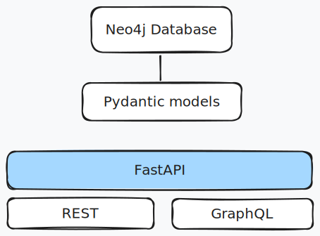

## Explore Relational and Graph databases

After looking at different schema languages in the first lab, the second lab is about exploring how the data is stored in various databases.

In this lab we'll look specifically at 2 types of database:
- A relational database (SQLite)
- A graph database (Neo4j)

## Sample application

A part of this lab, a sample application built on top of a graph database is available.

